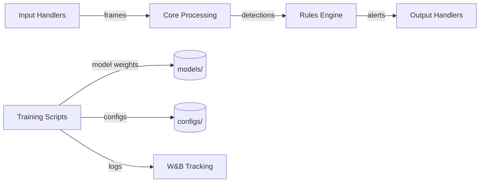

# Codebase Overview

> Industrial safety PPE detection system using YOLOv8 that identifies hard hats, safety vests, goggles, masks, gloves, and other protective equipment from video feeds and image directories, targeting deployment on SiMa.ai edge hardware.

**Last updated:** 2026-06-30
**Primary language:** Python 3.10+
**Architecture style:** Modular monolith (scripts + application source with input handlers)

---

## Architecture overview

The system is structured as a pipeline with four planned layers, currently two are implemented. Input handlers accept video files or image directories through an abstract base class. Training and validation are delegated entirely to Ultralytics' YOLO class, which manages the training loop, checkpointing, validation, and plotting. Model weights, datasets, configs (YAML), and W&B logs are the only state — there is no database, cache, or message queue.

The pipeline flows: **Input source** → (future: core processing) → (future: rules engine) → (future: output handlers). Currently only input handling and training/export scripts are functional. The `src/core/`, `src/rules/`, `src/output_handlers/`, and `src/utils/` directories exist as empty stubs for future phases.



---

## Tech stack

| Layer | Technology | Notes |
|---|---|---|
| Runtime | Python 3.10+ | Type hints used throughout |
| ML framework | Ultralytics 8.4.45 (YOLOv8) | Manages training lifecycle, validation, export |
| Deep learning | PyTorch 2.11.0+cu130 | CUDA 13.0 backend; class weights set via `model.model.class_weights` |
| Edge target | SiMa.ai | Static graph compiler requires fixed 640x640 input — never change `imgsz` |
| Video/image | OpenCV 4.13.0 | VideoCapture for MP4/AVI/MOV/MKV; image read for JPG/PNG/BMP/TIFF |
| Experiment tracking | Weights & Biases 0.26.1 | Initialized per training run; logs to `simaai-industry-safety` project |
| Model export | ONNX 1.21.0 + onnxruntime 1.25.1 | Static shape `[1, 3, 640, 640]` required; opset 12 |
| Augmentation | Albumentations (via oversample script) | YOLO bbox format; no vertical flip (unrealistic for PPE) |
| Numerics | NumPy 2.4.4, SciPy 1.17.1 | Core data manipulation |
| Plotting | Matplotlib 3.10.9 | Training curves and validation plots |

---

## Entry points

| Entry | Command | Purpose |
|---|---|---|
| Training | `python scripts/train_model.py` | Main training pipeline. Loads YOLOv8s, trains on unified dataset, validates, copies best model to `models/weights/` |
| Hyperparameter search | `python scripts/hyperparameter_search.py` | Grid search over model size (n/s/m), lr (0.001/0.005/0.01), optimizer (SGD/AdamW). Writes intermediate results crash-safe |
| Validation | `python scripts/validate_model.py` | Validates best model on test set, saves metrics to `reports/validation_metrics.json` |
| ONNX export | `python scripts/export_onnx.py` | Exports trained model to ONNX with static shape, verifies with dummy inference |
| Inference + tracking | `python scripts/inference_with_tracking.py` | Runs detection + ByteTrack on video/images. Accepts source path and confidence threshold as CLI args |
| Oversampling | `python scripts/oversample_minority.py` | Generates augmented variants of minority PPE classes using Albumentations |
| Augmentation template | `scripts/augmentation_template.py` | Reference implementation for YOLO-format augmentation with bbox validation |

---

## Key modules

| Path | Responsibility |
|---|---|
| `scripts/train_model.py` | Core training pipeline. Defines all hyperparameters, initializes W&B, trains YOLOv8s, validates, copies model. **Danger zone** — class weights list (10 values) and hardcoded paths are here |
| `scripts/hyperparameter_search.py` | Grid search across model sizes, learning rates, and optimizers. Writes `configs/best_config.yaml` and `configs/search_results.yaml` |
| `scripts/export_onnx.py` | ONNX export with static shape verification. Hardcoded path to best model weights |
| `scripts/inference_with_tracking.py` | CLI-driven inference with ByteTrack. Tries `.pt` then `.pth` model extensions |
| `scripts/oversample_minority.py` | Albumentations-based oversampling for underrepresented PPE classes. Uses per-class multipliers (hardhat=2x, vehicle=7x, etc.) |
| `src/input_handlers/base.py` | Abstract base class for input handlers. Defines `get_frame()` → `(np.ndarray, float)` and `release()` interface |
| `src/input_handlers/local_file.py` | Handles video files (MP4/AVI/MOV/MKV) and image directories (JPG/PNG/BMP/TIFF). Auto-detects input type |
| `src/input_handlers/rtsp_stream.py` | **Stub** — raises `NotImplementedError` on all methods. Placeholder for future RTSP phase |
| `configs/best_config.yaml` | Best hyperparameters from search: yolov8m, lr=0.005, SGD. Contains numpy scalar objects (see non-obvious patterns) |
| `configs/search_results.yaml` | Full hyperparameter search results across all experiments |

> ⚠️ `scripts/train_model.py` — Contains hardcoded class weights, data paths, and training constants. Changes here directly affect model quality. Always validate after modifying.

---

## Non-obvious patterns

**Fixed 640x640 input — SiMa.ai static graph constraint**
The SiMa.ai edge compiler requires a fixed input tensor shape. The `imgsz=640` parameter is hardcoded in `train_model.py`, `hyperparameter_search.py`, and `export_onnx.py`. Changing this value without updating the SiMa.ai compiler configuration will produce a model that cannot deploy. The ONNX export explicitly sets `dynamic=False` and verifies the output shape is `[1, 3, 640, 640]`.

**Class weights are hardcoded inverse-frequency values**
Ten PPE classes have manually computed inverse-frequency weights in `train_model.py` (line 194): `[0.5, 2.15, 4.98, 2.82, 2.50, 7.54, 3.87, 3.44, 2.35, 7.57]`, normalized so the mean equals 1.0. These must be recalculated if dataset class distribution changes. The hyperparameter search script duplicates these weights and applies them via `model.model.class_weights` (a PyTorch tensor) because the `cls_pw` training parameter does not accept lists in that context.

**Ultralytics manages the full training lifecycle**
Training loops, validation, checkpointing, early stopping, and plot generation are all delegated to the `YOLO.train()` and `YOLO.val()` methods. Custom code only handles configuration, W&B initialization, and model file management. Do not attempt to implement custom training loops — use Ultralytics' API.

**`best_config.yaml` contains numpy scalar objects**
The YAML file serialized by the hyperparameter search includes `!!python/object/apply:numpy._core.multiarray.scalar` tags for mAP values. Loading this file with `yaml.safe_load()` will fail. Use `yaml.full_load()` or extract values programmatically.

**Augmentation avoids vertical flip**
PPE items (hard hats, vests) have a natural orientation. Vertical flips produce unrealistic training samples. The augmentation pipeline uses only horizontal flip and ±30° rotation.

**No database, cache, or queue**
All state is file-based: model weights (`.pt`, `.pth`, `.onnx`), datasets (directory structure with YOLO labels), experiment configs (YAML), and logs (W&B, `runs/` directories). There are no migrations, connection pools, or distributed state.

---

## Development workflow

```bash
# 1. Create virtual environment
python -m venv .venv
.venv\Scripts\activate        # Windows
# source .venv/bin/activate   # Linux/Mac

# 2. Install dependencies
pip install -r requirements.txt

# 3. Prepare dataset
# Place YOLO-format data in: data/processed/unified_dataset/
# Structure: data.yaml, train/images/, train/labels/, val/images/, val/labels/

# 4. Train model
python scripts/train_model.py

# 5. Validate model
python scripts/validate_model.py

# 6. Run hyperparameter search (optional, runs 18 experiments)
python scripts/hyperparameter_search.py

# 7. Export for edge deployment
python scripts/export_onnx.py

# 8. Run inference with tracking
python scripts/inference_with_tracking.py <source_path> [confidence_threshold]
```

**Data augmentation workflow:**
```bash
# Oversample minority classes
python scripts/oversample_minority.py
# Output: data/processed/unified_dataset/train_oversampled/
```

---

## Before you change code

- The `imgsz=640` value appears in `train_model.py`, `hyperparameter_search.py`, and `export_onnx.py`. All three must stay in sync, and the SiMa.ai compiler configuration must match.
- Class weights in `train_model.py` (line 194) and `hyperparameter_search.py` (line 15) are duplicated. Changing one without the other creates silent training divergence.
- `RTSPHandler` in `src/input_handlers/rtsp_stream.py` raises `NotImplementedError` on every method. Do not instantiate it — use `LocalFileHandler`.
- The `data.yaml` path is hardcoded in `train_model.py` (line 49) and `validate_model.py` (line 11). Changing the dataset location requires updating both.
- `configs/best_config.yaml` contains numpy scalar objects. Do not parse with `yaml.safe_load()` — it will fail on the `!!python/object/apply` tags.
- Augmentation scripts use Albumentations with YOLO bbox format (`format='yolo'`). Bboxes are `[x_center, y_center, width, height]` normalized to [0,1]. Using Pascal VOC format will corrupt labels.
- The `inference_with_tracking.py` script tries `detection_model.pt` first, then `detection_model.pth`. Ensure the model file has one of these names in `models/weights/`.

---

## Staleness risks

| Risk item | Why it goes stale |
|---|---|
| Class weights list (10 values in `train_model.py` and `hyperparameter_search.py`) | Dataset class distribution changes when new images are added or classes are redefined |
| Hardcoded paths in `train_model.py`, `validate_model.py`, `export_onnx.py` | Dataset location, model paths, and run directories change during refactoring |
| `configs/best_config.yaml` numpy scalar serialization | May break if numpy or PyYAML versions change |
| `data/processed/unified_dataset/data.yaml` path | Dataset reorganization or renaming |
| SiMa.ai static graph constraint (`imgsz=640`, `dynamic=False`) | Hardware SDK updates may support dynamic shapes |
| Augmentation multipliers in `oversample_minority.py` | Class balance shifts as dataset grows |
| Ultralytics API usage patterns | Version upgrades may change method signatures |
